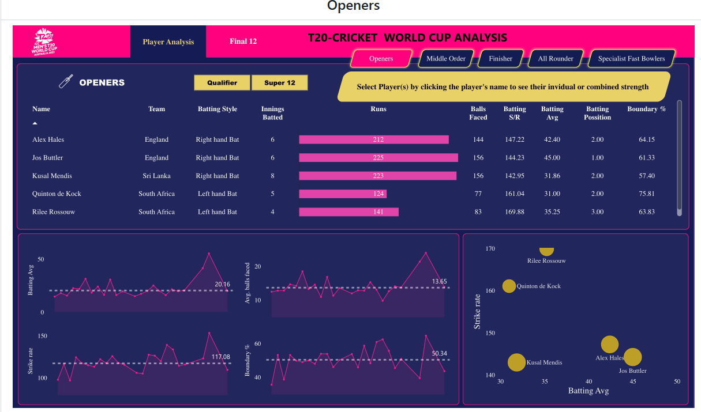
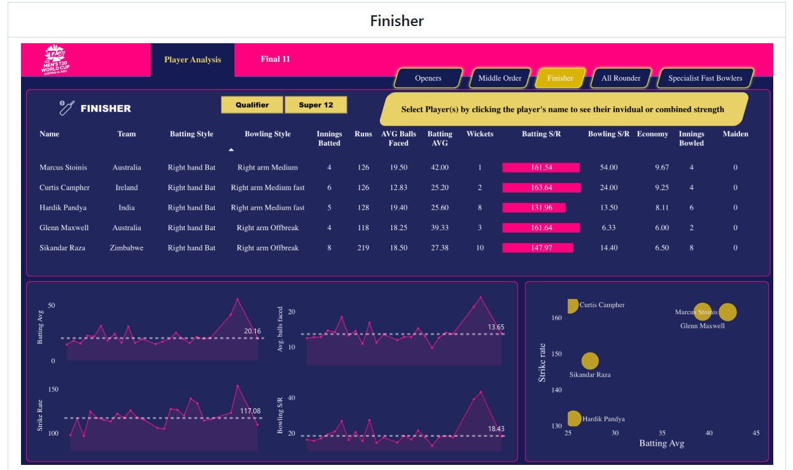

# 🏏 Best Playing 11 - Men’s Cricket Data Analytics

A Power BI Dashboard project to analyze and select the top 11 players from the **T20 Men’s Cricket World Cup 2022**, using scraped data and performance metrics.

---

## 📚 Table of Contents

- [🎯 Problem Statement](#-problem-statement)
- [🌐 Data Collection](#-data-collection)
- [🔄 Data Transformation](#-data-transformation)
- [🧩 Data Modelling](#-data-modelling)
- [🧮 Data Analysis Expressions (DAX)](#-data-analysis-expressions-dax)
- [📊 Reports & Visualizations](#-reports--visualizations)
- [🛠 Tools and Libraries Used](#-tools-and-libraries-used)
- [🔗 References](#-references)

---

## 🎯 Problem Statement

This project aims to review and compare performances of all players in the **T20 Men’s Cricket World Cup 2022** via an interactive Power BI dashboard.

The dashboard also allows selection of the **Best Playing 11** players based on well-defined performance metrics (batting, bowling, fielding, etc.).

---

## 🌐 Data Collection

- Scraped match and player career data from [ESPN Cricinfo](https://www.espncricinfo.com) using **Bright Data**.
- Used **BeautifulSoup** in **Python** to collect structured JSON data.
- Data was transformed into **pandas DataFrames** and saved as CSVs for further use in Power BI.

### 📷 Screenshots


---

## 🔄 Data Transformation

Initial cleaning and transformation included:

- Handling missing values
- Correcting inconsistent player names
- Removing duplicates
- Merging match/player data on `matchID`, `playerID`, etc.

Used:
- **pandas/json** in Python
- **Power Query** inside Power BI

---

## 🧩 Data Modelling

- Connected datasets using match IDs, player IDs, and team IDs.
- Created relationships between batting, bowling, and player info tables.
- Built calculated columns and measures using DAX for dynamic filtering and KPI visualization.

### 📷 Data Model Screenshot


---

## 🧮 Data Analysis Expressions (DAX)

### 🔹 Batting Metrics

```DAX
Total Runs = SUM(t20_batting_summary[runs])
Total Innings Batted = COUNT(t20_batting_summary[matchID])
Total Innings Dismissed = SUM(t20_batting_summary[Out])
Batting Avg = DIVIDE([Total Runs],[Total Innings Dismissed],0)
Total Balls Faced = SUM(t20_batting_summary[balls])
Strike Rate = DIVIDE([Total Runs],[Total Balls Faced],0) * 100
Boundary % = DIVIDE(SUM(t20_batting_summary[Boundary runs]), [Total Runs], 0) * 100
Avg. Balls Faced = AVERAGE(t20_batting_summary[balls])
Batting Position = ROUNDUP(AVERAGE(t20_batting_summary[battingPos]), 0)
Fours = SUM(t20_batting_summary[fours])
Sixes = SUM(t20_batting_summary[sixes])
Boundary Runs (Batting) = t20_batting_summary[fours]*4 + t20_batting_summary[sixes]*6
🔹 Bowling Metrics
Wickets = SUM(t20_bowling_summary[wickets])
Balls Bowled = SUM(t20_bowling_summary[balls])
Runs Conceded = SUM(t20_bowling_summary[runs])
Economy = DIVIDE([Runs Conceded], ([Balls Bowled]/6), 0)
Bowling Strike Rate = DIVIDE([Balls Bowled], [Wickets], 0)
Bowling Average = DIVIDE([Runs Conceded], [Wickets], 0)
Total Innings Bowled = DISTINCTCOUNT(t20_bowling_summary[matchID])
Dot Ball % = DIVIDE(SUM(t20_bowling_summary[zeros]), SUM(t20_bowling_summary[balls]), 0)
Fours Conceded = SUM(t20_bowling_summary[fours])
Sixes Conceded = SUM(t20_bowling_summary[sixes])
Boundary Runs (Bowling) = t20_bowling_summary[fours]*4 + t20_bowling_summary[sixes]*6
🔹 Dynamic Selection & UX
Player Selection = IF(ISFILTERED(t20_players_info[name]), "1", "0")
Display Text = IF([Player Selection] = "1", " ", "Select Player(s) by clicking the player's name to see their individual or combined strength")
Color Callout Value = IF([Player Selection] = "0", "#E8D166", "#1D1D2E")
📊 Reports & Visualizations
Built using Microsoft Power BI Desktop, the dashboard includes:

Player Role-Based Pages:

Openers

Middle Order

Finishers

All-Rounders

Specialist Fast Bowlers

Final Best 11 Team

Features:

Filterable visuals

KPI cards and role-wise insights

Comparative analysis and boundary contribution

Final player selection logic built into UX

## 📷 Report Screenshots

### 🔸 Openers



### 🔸 Middle Order


### 🔸 Finisher


### 🔸 All Rounders


### 🔸 Final Best 11


🛠 Tools and Libraries Used
Tool / Library	Purpose
Jupyter Notebook	Code execution and scripting
Python	Data scraping and transformation
pandas, json	Data manipulation
BeautifulSoup	Web scraping
Bright Data	Data collector tool
Power Query Editor	ETL inside Power BI
Power BI Desktop	Dashboard creation and DAX calculations
JavaScript (Bright Data)	For customizing collector logic

🔗 References
📘 Codebasics Power BI Course

📊 ESPN Cricinfo Tournament Stats

🏏 Match Scorecard – Namibia vs Sri Lanka

🧰 Bright Data Collector


